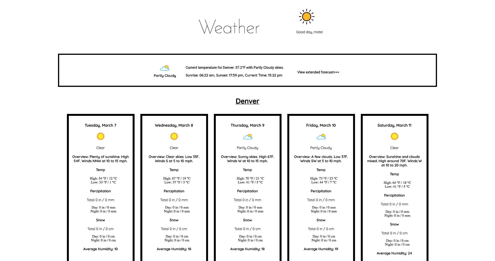

## Weatherly
#### A webbased application that uses React, Redux, Router 3 and an external API to a display weather forecasts for your current location (accessed via the browser) and up to three other "pinned" cities.

## Project Screen Shots

## Installation and Setup Instructions

Clone down this repository. You will need `npm` installed globally on your machine.  

Installation:

`npm install`  

<!-- To Run Test Suite: //tests will be pushed up shortly -->

<!-- `npm test`   -->

To Start Server:

`npm start`  

To Visit App:

`localhost:3000/`  

## Reflection

This was a group project during Module 3 at Turing School of Software & Design.  

As a group of three, we set out to build a clean, well-built React-Redux web application.  This was my first exposure to Redux and this project was a great learning experience - I really enjoyed learning Redux and the simplicity it creates for handling data in a React app.
